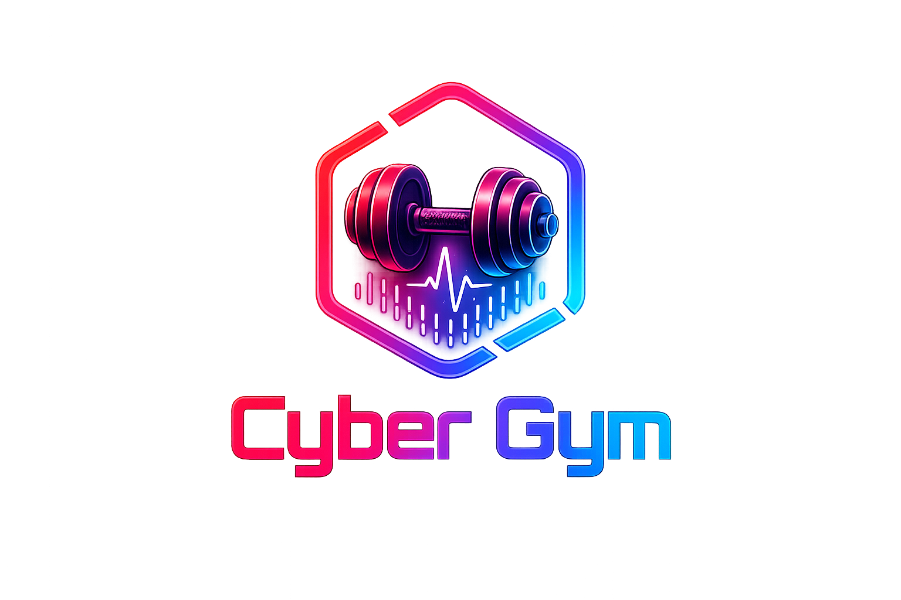

# Cyber Gym OS

A local-network home gym dashboard with AI coaching, workout tracking, strength levels, form videos, and plate calculator. Runs on your home server or PC — no internet required during workouts (except the AI coach).



---

## Quick Install (Linux)

```bash
chmod +x install.sh
./install.sh
```

That's it. The installer will:
- Check / install Node.js 18+ if needed
- Prompt for your Anthropic API key (for the AI coach)
- Build the app
- Create a desktop icon and Applications menu entry
- Optionally start Cyber Gym automatically at login

**After installing**, double-click the desktop icon or open a browser to `http://localhost:3000`.

---

## Getting an Anthropic API Key

The AI coach is powered by Claude. API keys are free to get:

1. Go to [console.anthropic.com](https://console.anthropic.com)
2. Sign up / log in
3. Click **API Keys** → **Create Key**
4. Paste the key (`sk-ant-...`) when the installer asks

If you skipped the key during install, add it later by editing:
```
~/.local/share/cyber-gym/.env
```

---

## Sharing with a Friend

1. Send them the zip file of this project
2. They unzip it and run `./install.sh`
3. They enter their own Anthropic API key when prompted
4. Done — each person has their own independent install with their own workout data

---

## Manual Launch (without the icon)

```bash
~/.local/share/cyber-gym/forge.sh
```

Or if you're running from the project folder directly:
```bash
./forge.sh
```

---

## Auto-start at Login

The installer asks if you want this. To change it later:

```bash
# Enable auto-start
systemctl --user enable cyber-gym
systemctl --user start  cyber-gym

# Disable auto-start
systemctl --user disable cyber-gym
systemctl --user stop    cyber-gym

# Check status / view logs
systemctl --user status cyber-gym
journalctl --user -u cyber-gym -f
```

---

## Accessing from Other Devices on Your Network

Once running, open a browser on any device on your home network and go to:
```
http://[your-pc-ip]:3000
```

Find your IP with `hostname -I`. Works great on a phone or tablet as a mobile workout companion.

---

## Uninstall

```bash
./uninstall.sh
```

Or from any location:
```bash
~/.local/share/cyber-gym/uninstall.sh
```

---

## Windows

Double-click `FORGE.bat`. Requires [Node.js](https://nodejs.org) installed first. Add your API key to `.env` in the project folder.

---

## Dev Mode

```bash
npm run dev
```

Starts the backend on `:3000` and Vite dev server on `:5173` with hot reload.

---

## What's Inside

| Feature | Details |
|---|---|
| **Workout builder** | Pick exercises from 42-exercise library, configure sets/reps/rest |
| **AI Coach** | Claude-powered routine generator, weekly recap, rest day intelligence |
| **Form videos** | Side-view MP4s for every exercise (populated by `scrape_musclewiki.py`) |
| **Muscle diagrams** | Primary/secondary muscle highlights per exercise |
| **Plate calculator** | Live breakdown of plates to load on the Smith bar |
| **Strength levels** | Beginner → Elite scale per exercise based on your PR history |
| **Progressive overload** | Suggests weight increases when you've hit all reps |
| **PR tracking** | Epley 1RM estimation, PR flash on summary screen |
| **Workout templates** | Save and relaunch named workouts in one tap |
| **History** | Full set-by-set log with repeat functionality |
| **Bodyweight log** | Chart your weight over time, feeds into AI context |
| **Streak tracker** | Consecutive training day counter |
| **Kiosk mode** | Fullscreen button for touchscreen display |
| **LAN access** | Works from any device on your home network |

---

## Adding Form Videos

Run the scraper to download side-view form videos from MuscleWiki:

```bash
python3 scrape_musclewiki.py ~/.local/share/cyber-gym
```

Or from the project folder:
```bash
python3 scrape_musclewiki.py .
```

Videos download to `public/exercises/` — the app picks them up automatically. Takes about 60 seconds for all 42 exercises.
